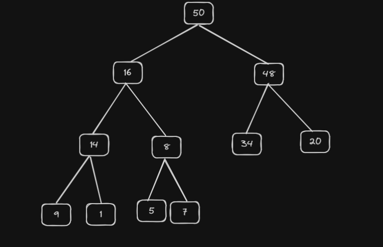
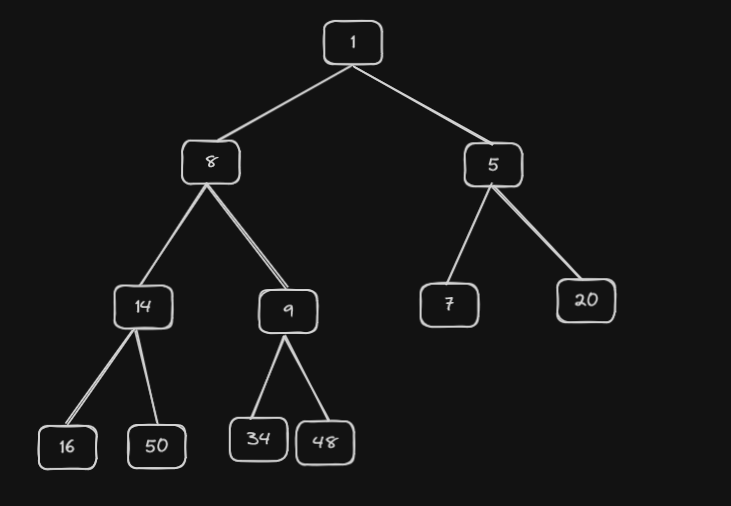

A heap is a data structure that is based on the heap property. The heap data structure is used in selection, graph, and k-way merge algorithms. Operations such as finding, merging, insertion, key changes, and deleting are performed on heaps. Heaps are part of the container/heap package in Go. According to the heap order (maximum heap) property, the value stored at each node is greater than or equal to its children.

If the order is descending, it is referred to as a maximum heap; otherwise, it's a minimum heap.

**MaxHeap**

max heap example in visual representation.

In the max heap, the root node is always the max value in the heap and the child value will be smaller in the number.

**MinHeap**

In the min heap the root node is always the minimum value in the heap and the child value will be greater than the root/parent value 

to visualize the heap we will use the heap as a tree but in actuality, we will use an array as the underlying data structure in the heap to store the value. 

