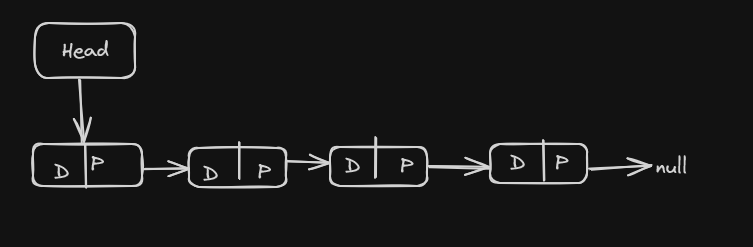

A list is a sequence of elements. Each element can be connected to another with a link in a forward or backward direction. The element can have other payload properties. This data structure is a basic type of container. Lists have a variable length and developer can remove or add elements more easily than an array. Data items within a list need not be contiguous in memory or on disk.

**Basic link list structure**

**Head** :
Head is to store the starting poin of the link list.

**Node** :
In the link list we have Node to hold the value and address and in Nodes we have tow section one to hold the value and the second section is to hold the address for next node that we have to access after this node it's like a chain where one chain is connected to another chain and in the last node next node address is null it will indicate that the linklist is ended here.

